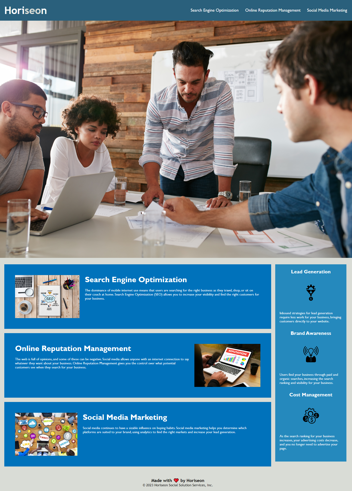

# horiseon_portfolio_page

## Description

The motivation for this project was to refactor a landing page for Horiseon Social Solution Services, Inc., to better optimize their page for Search engine optimization. 
The problems this project solves are better semantically formatting the html document to have better a better SEO score, and to consolidate css for better readibility and to reduce code "wetness". Things I learned from this project contain organizing CSS files to better fit the flow of the HTML document, and how to semantically format an exisiting HTML document. 

## Installation

### Requirements for tutorial

    - VSCode is installed on your local computer
    - You have a github account that is linked to your local computer
    - A folder to clone the repo to

To install, watch [this loom video tutorial](https://www.loom.com/share/3feca10cd37640ae8a80f037e89d76ca?sid=cc396d34-1432-46ea-9bde-8c94203a6e06).

## Usage

This static page is used to talk about the company Horiseon and its benefits. 

Rendered page:

## Credits

This project was solely developed by me, drawing upon the resources provided by the Rutgers University Bootcamp Course.

## License

This project is licensed under the MIT License.